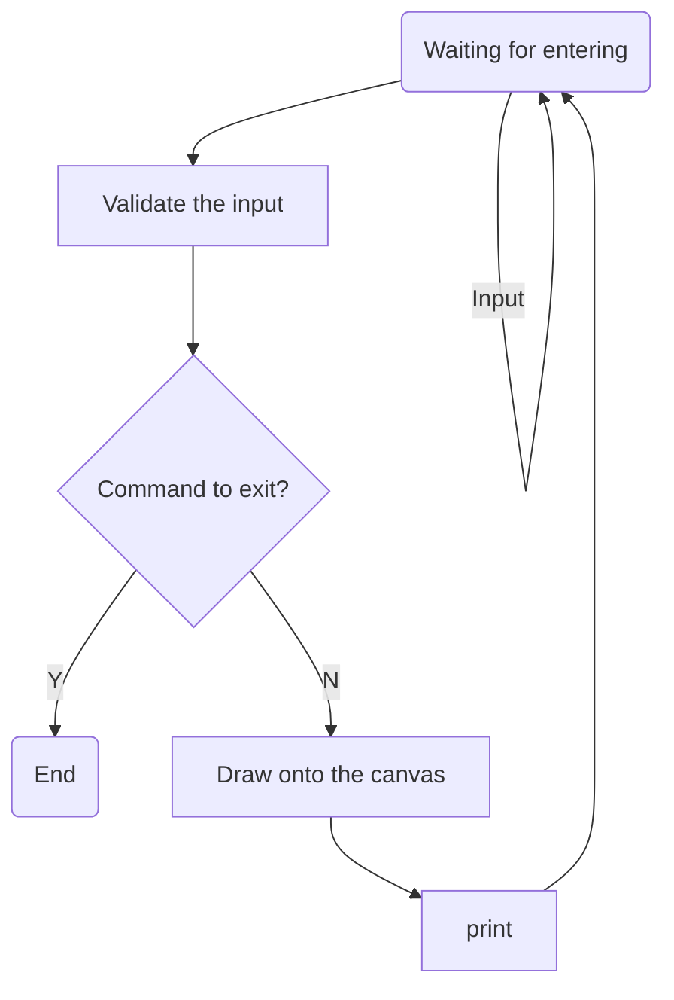

# How to run the program

1. Make sure the node.js (Testing is passed with ^16.0.0) is installed,
2. git clone https://github.com/TristanWYL/draw-in-console.git
3. cd draw-in-console
4. npm install
5. npm run dev

# How to debug the program

Refer to [this gist](https://gist.github.com/TristanWYL/8bc8f9828146b2b9dd8fbbf91b78547e) for instructions.

# How to add a new command

1. Add a new command validator into ./src/validator/, which inherits from the `Validator` class,
2. Add a new worker into ./src/worker/, which inherits from the `Worker` class,
3. Tweak the two mappers in ./src/mapper/, to add relevant mappings for the new command,
   
# Special cases not covered

There should be none.

# Assumptions and how are they handled

So far no assumption is applied, as such you could input anything you want, and the program will handle basically all input.

# Workflow

